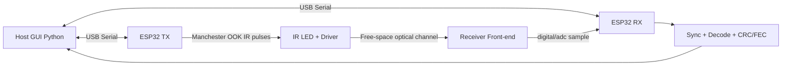

# ESP32 IR FSO MVP (Day-1 Prototype)

Minimal free-space optical (FSO) digital link for **5 m indoor LOS** demo using ESP32 + IR transmitter/receiver.

## 1) Overview

This implementation is intentionally scoped for a one-day prototype:
- PHY: **OOK + Manchester** with **38 kHz carrier bursts** at default **2 kbps** (VS1838B-compatible).
- Framing: preamble + sync + length + payload + CRC16.
- Robustness: adaptive thresholding on RX (EWMA baseline + hysteresis), CRC integrity checks, optional Hamming(7,4) module.
- Host tools: Python GUI for real-time RSSI proxy, BER trend, eye-like overlay, and CSV logging.

Why this design fits your goal:
- Low-cost and off-the-shelf (ESP32 + IR parts).
- Jam-resistant medium (optical LOS, narrow beam).
- Compatible with VS1838B digital IR receiver module using the same host protocol/GUI.

## 2) Architecture Diagram



## Repository Layout

- `firmware/common/` shared protocol + optional FEC C helpers
- `firmware/arduino/` Arduino IDE TX/RX sketches for ESP32-WROOM dev boards
- `firmware/tx/` ESP-IDF TX app
- `firmware/rx/` ESP-IDF RX app
- `host/` Python GUI + serial protocol + logging
- `docs/` wiring + test procedure

Detailed documentation:
- `docs/code_structure.md` code architecture and data flow
- `docs/run_guide.md` full setup/flash/run instructions
- `docs/hardware.md` wiring and hardware sizing notes
- `docs/test_plan.md` validation and BER/range checklist

## 3) Build & Run

### Firmware (Arduino IDE, recommended)
- Open `firmware/arduino/tx/tx.ino`, select `ESP32 Dev Module`, upload to TX board.
- Open `firmware/arduino/rx/rx.ino`, select `ESP32 Dev Module`, upload to RX board.
- Use `115200` serial monitor baud for both.

### Firmware (ESP-IDF, optional legacy)
Build TX:
```powershell
cd firmware/tx
idf.py set-target esp32
idf.py build
idf.py -p COMx flash monitor
```

Build RX:
```powershell
cd firmware/rx
idf.py set-target esp32
idf.py build
idf.py -p COMy flash monitor
```

### Python Host
```powershell
pip install -r requirements.txt
python host/gui_app.py
```

## 4) Quick Wiring (details in docs)

- TX:
  - ESP32 GPIO18 -> gate/base of LED driver transistor (through resistor)
  - IR LED in series with current limit + transistor switch (driven as 38 kHz burst carrier)
  - Shared GND
- RX (VS1838B):
  - VS1838B VCC -> 3V3
  - VS1838B GND -> GND
  - VS1838B OUT -> ESP32 GPIO14 (active-low)

## 5) Demo Testing

Follow `docs/test_plan.md` for:
- bench bring-up
- 1 m to 5 m BER sweep
- ambient light stress
- alignment and fallback checks

For complete operator steps from zero to demo, use `docs/run_guide.md`.

## Safety Notes

- Never exceed IR LED pulse current/thermal limits.
- Avoid eye exposure to high-power IR beams.
- Use current-limiting and duty-cycle guardrails in firmware.
